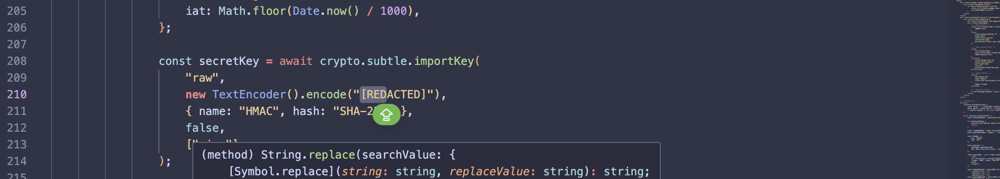
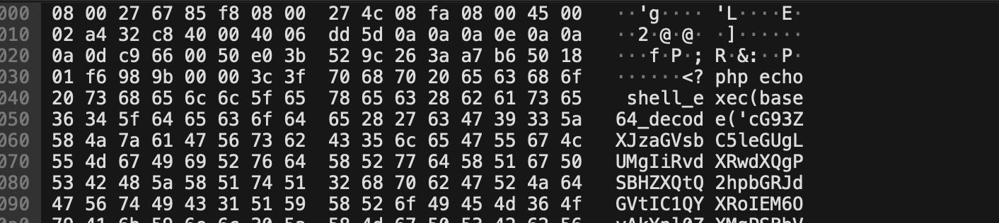
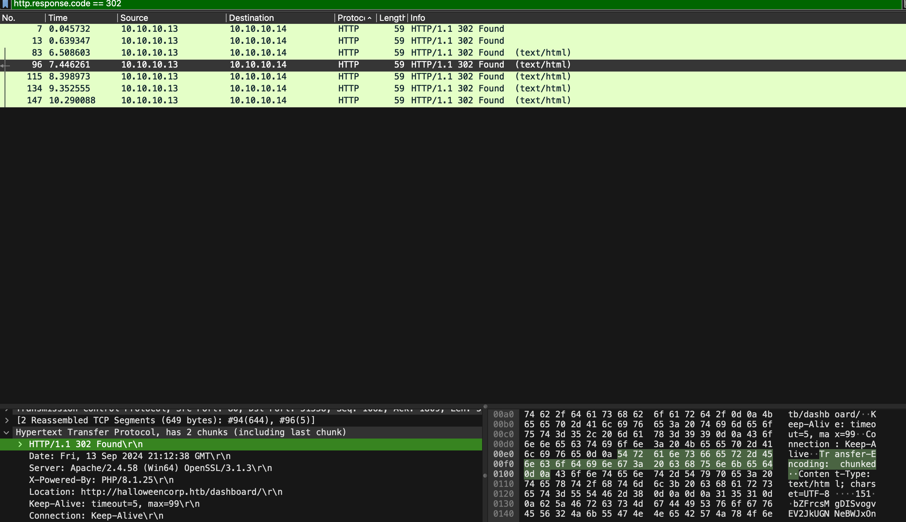
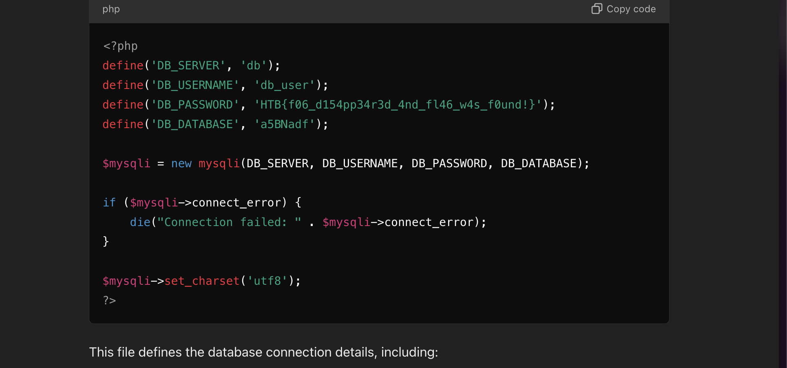
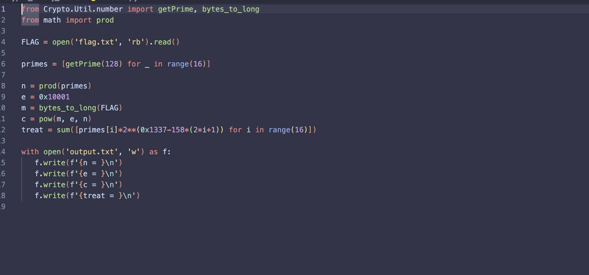
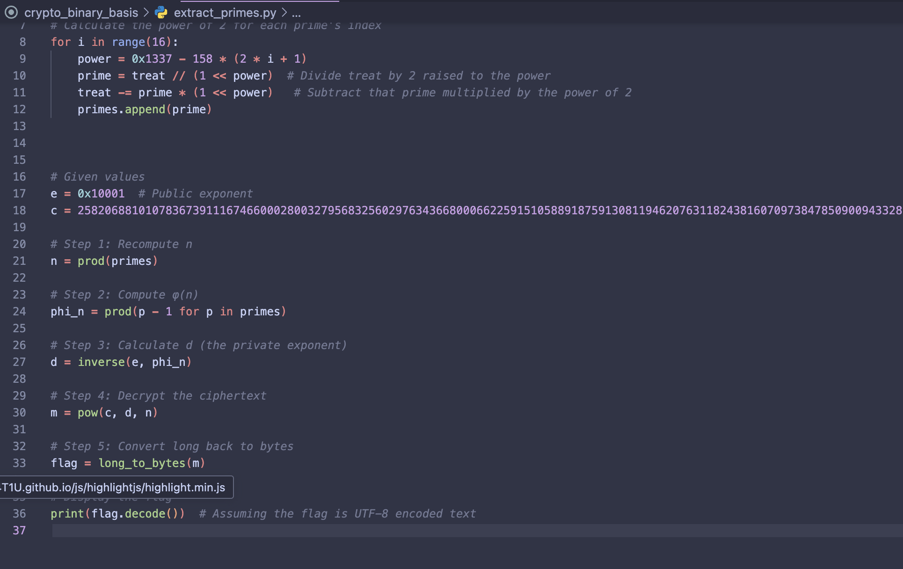
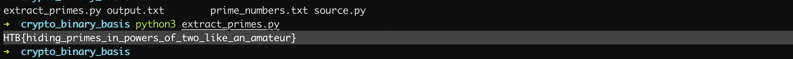

# 0x02 Hack The Boo 2024
I played a little bit of Hack the boo 2024 CTF here are the walkthrough for the flags i have got
I forgot to take screenshots, when the challanges will be posted on main platform i will come back and add screenshots
## WayWitch Web
From reading the provided source code we can learn that we have a basic app that creates a ticket and adds it to the database
also the application has one extra route /tickets that dumps all the tickets from the database
inside the database we see there is a special ticket that contains the flag.

But to get the tickets we must pass the jwt token validation

After a googling jsonwebtoken npm we see that it is vulnerable to a JWT Key Confusion attack (CVE-2015-9235)
all we need is to find the secret used for token generation

It is written in clear txt inside index.html
now we run the poc found on github and we get a new jwt token that we can use instead of the one provided and we get access to /tickets
and thats it!
## Web Cursed Stale Policy WEB
will add after hackthebox posts the challanges to be able to provide screenshots from the app

## PWN El Pipo
This one is quite simple, upon analyzing the source code we see upon analyzing the binary file that it does a read and compares it 
than there is a jump if zero instruction.

if the cmp fails and the jz instruction doesnt get executed we see that it goes and reads the flag
So we just need to make the jz fail, filling the buffer with a bunch of "A"s does the trick

## Foggy Intrusion Forensics
For this one we get a wireshark capture file and we need to study it to understand the attack
We see there is only http and tcp trafic
We filter for http only and we start analyzing
we see there is an interesting packet that is base64 encoded

```powershell
powershell.exe -C "$output = Get-ChildItem -Path C:; $bytes = [Text.Encoding]::UTF8.GetBytes($output); $compressedStream = [System.IO.MemoryStream]::new(); $compressor = [System.IO.Compression.DeflateStream]::new($compressedStream, [System.IO.Compression.CompressionMode]::Compress); $compressor.Write($bytes, 0, $bytes.Length); $compressor.Close(); $compressedBytes = $compressedStream.ToArray(); [Convert]::ToBase64String($compressedBytes)"powershell.exe -C "$output = Get-ChildItem -Path C:; $bytes = [Text.Encoding]::UTF8.GetBytes($output); $compressedStream = [System.IO.MemoryStream]::new(); $compressor = [System.IO.Compression.DeflateStream]::new($compressedStream, [System.IO.Compression.CompressionMode]::Compress); $compressor.Write($bytes, 0, $bytes.Length); $compressor.Close(); $compressedBytes = $compressedStream.ToArray(); [Convert]::ToBase64String($compressedBytes)"
```
now its clear that the attacker used an rce vulnerability read files and encrypted them.

we go through the 302 accepted requests and take the http frame and ask chatgpt to reverse the encoding made using the powershell script from above.

and we get the flag:HTB{f06_d154pp34r3d_4nd_fl46_w4s_f0und!}

## Crypto Binary Basics Cryptography
We got a basic RSA algorithm that uses 16 primes
but we see that it also calculates a treat that multiplies every prime number with a constant value.
We are able to reverse this and get the prime numbers used in the calculation.



Then we use a progrma to reverse the rsa encryption.

and get the flag:
